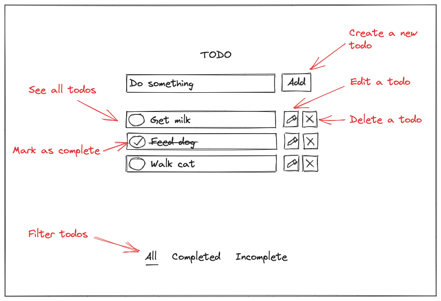
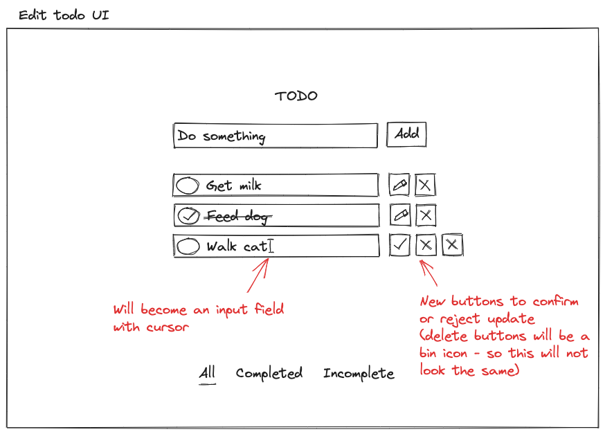
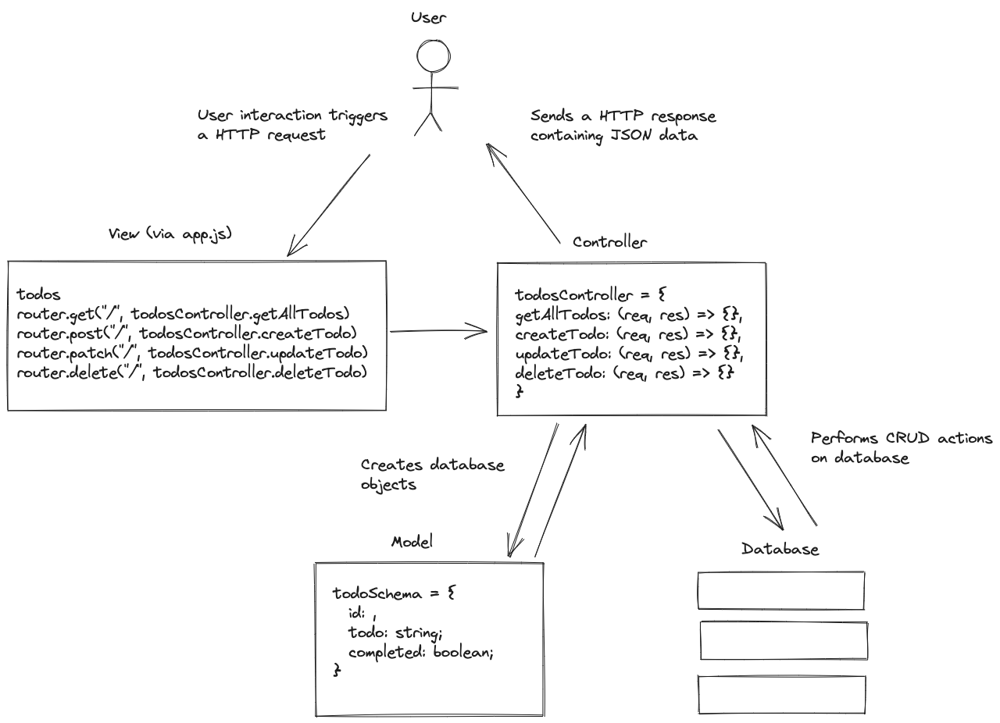
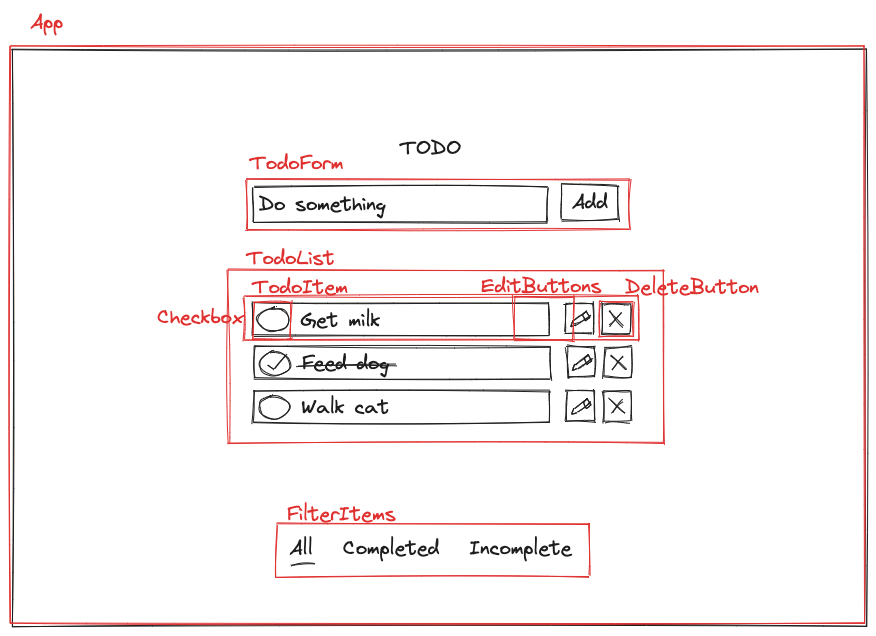

# Todo List App

I want to make a simple full-stack CRUD app so that I can focus on process and also go on to make the same app utilising and learning different backend frameworks. I will be strictly using TDD throughout.

You will be able to create a todo, mark it as complete, see all items in your todo list, edit todos, delete todos and filter for complete and incomplete todos.

In the frontend, I will use React and Next.js (along with TypeScript, TailwindCSS) as recommended in the React docs. I will use Cypress for both end-to-end and component testing and I intend to build this both with separate backends as well as using Next.js' own serverless architecture.

For the database, I will be using MongoDB.

## The MERN stack app

Here, I will be building the App with a backend API built with Node.js and Express, and Jest for testing.

The React frontend sends HTTP request to the backend API and receives JSON data in response.

### See the other projects:

## Installation

```plain
$ git clone https://github.com/sarahc-dev/todolist-collection.git
$ cd todolist-collection
...
```

## Planning

### User stories

```plain
As a user
So that I can remember something I need to do
I want to create a new todo

As a user
So that I can keep track of all of my todos
I want to see all of my todos

As a user
So that I can check off my todolist
I want to mark a todo as complete

As a user
So that I can update a todo item
I want to edit a todo

As a user
So that I can remove a todo item
I want to delete a todo

As a user
So that I can see what I have done
I want to filter completed todos

As a user
So that I can see what I still have to do
I want to filter incomplete todos
```

### Wireframes

This is a rough outline of how the app will look.





### Backend Design

I will be following the Model-View-Controller (MVC) architectural pattern.

- Model - defines the database model and structure of the data (database schema)
- View (Route) - defines the API endpoints, and thus the communication between the front and backend. It matches a user request to the appropriate controller action.
- Controller - handles the logic and interaction with the database based on the user request.



### Frontend Component Design

This is my initial plan for the component breakdown. It may change slightly, particularly in terms of the editing functionality.


