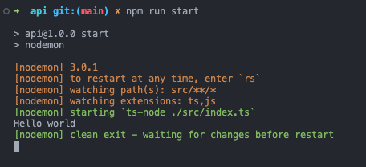

# Todo List App

I want to make a simple full-stack CRUD app so that I can focus on process and also go on to make the same app utilising and learning different backend frameworks. I will be trying to utilise TDD throughout.

You will be able to create a todo, mark it as complete, see all items in your todo list, edit todos, delete todos and filter for complete and incomplete todos.

In the frontend, I will use React and Next.js (along with TypeScript, TailwindCSS) as recommended in the React docs. I will use Cypress for both end-to-end and component testing and I intend to build this both with separate backends as well as using Next.js' own serverless architecture.

For the database, I will be using MongoDB.

## The other repositories

- [Frontend - React (Next.js), TypeScript, TailwindCSS and Cypress](https://github.com/sarahc-dev/todolist-frontend-nextjs)
- [Backend - Java Spring Boot and Junit](https://github.com/sarahc-dev/todolist-java-spring-boot)
- [Next.js API route handler](https://github.com/sarahc-dev/todolist-nextjs-api)

## The MERN stack app

Here, I will be building the App with a backend API built with Node.js, Express and TypeScript. I am using Jest and Supertest for testing.

The React frontend sends HTTP requests to the backend API and receives JSON data in response.

## Installation

```bash
git clone https://github.com/sarahc-dev/todolist-collection.git
cd todolist-collection
cd api
npm install
```

To run the tests:

```bash
npm run test
```

To run the test server (uses test db):

```bash
npm run start:test
```

## Planning

### User stories

```plain
As a busy user
So that I can remember something I need to do
I want to create a new todo

As a busy user
So that I can keep track of all of my todos
I want to see all of my todos

As a busy user
So that I can check off my todolist
I want to mark a todo as complete

As a busy user
So that I can update a todo item
I want to edit a todo

As a busy user
So that I can remove a todo item
I want to delete a todo

As a busy user
So that I can see what I have done
I want to filter completed todos

As a busy user
So that I can see what I still have to do
I want to filter incomplete todos
```

### Wireframes

This is a rough outline of how the app will look.


### Backend Design

I will be following the Model-View-Controller (MVC) architectural pattern.

- Model - defines the database model and structure of the data (database schema)
- View (Route) - defines the API endpoints, and thus the communication between the front and backend. It matches a user request to the appropriate controller action.
- Controller - handles the logic and interaction with the database based on the user request.


## Process

I began by creating the backend. I wanted to learn more about integrating TypeScript in the backend and understand everything I am doing so I have set up my backend from scratch.

I started off by setting up the TypeScript compiler and console logging "Hello World" to ensure that this is working correctly.



From these humble beginnings, and in the name of TDD I could now start to write my first test. I am using Jest and Supertest, a library that enables you to test APIs, for integration tests. So I started with the integration test. Guided by TypeScript and Jest errors, I found my way to my first "expected" error. This is a failing test I love to see, because it means I have set up everything else correctly.


I initially got this test to pass with hard-coded data. I then wanted to get the data from a database. I added another test to assert that the array would be empty if there were no todos to drive the need to return dynamic data. I implemented the database and test drove each of the controller methods from my design step.

## Testing Coverage


## Learning

I spent some time researching whether I should implement unit tests for my model and controller functions or not. I could have had my model implement the functions that interact with the database, and I could have tested these separately with mongodb-memory-server - which is a package that spins up an in-memory database for testing purposes. Ultimately, this would  only have been testing that the mongoose methods do what they should. As this is not code I own, arguably this is not necessary.

I also looked at implementing unit tests on my controller, and again found an argument not to. After mocking req and res provided by the Express framewrork and the database, there is no code of my own to test. Therefore I have opted for integration tests using Supertest and a couple of unit tests of my model schema. In a more complicated application, with more business logic I would use unit tests to test this functionality.

Having now recreated the backend in Java with the Spring Boot architecture, the unit testing of the controller makes a lot more sense to me now. Here, I separated the Service layer which could then be mocked making testing much easier.
